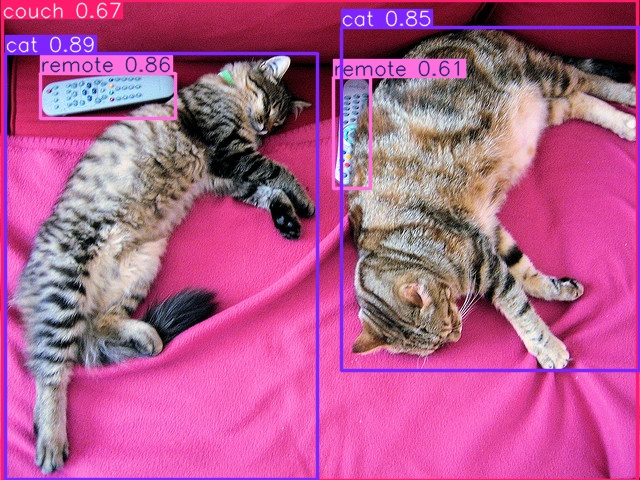

# SUML_03_Docker
# Image Classification using YOLOv5

## Description
This project is for image classification using the YOLOv5 model.  
YOLOv5 (You Only Look Once) is one of the most popular architectures for image processing. It is fast and accurate in detecting and classifying objects in images.

## Requirements
- Docker installed on your computer

## How to Run the Application

1. Clone the repository:
   ```bash
   git clone https://github.com/RutkowskaKarolina/SUML_03_Docker
   cd SUML_03_Docker

2. Option 1 — Build Locally
   To build the Docker image, use the following command:

   ```bash
   docker build -t yolov5s-model .
    ```
   Run the application:
   ```bash
   docker run -p 5000:5000 yolov5s-model

2. Option 2 — Pull Prebuilt Image from Docker Hub
   Skip building and pull the ready-to-use image:
    ```bash
    docker pull kolka222/yolov5s-model:latest
    docker run -p 5000:5000 kolka222/yolov5s-model:latest

3. Open the application in your browser:

  ```bash
http://localhost:5000
```

## How to Use the Application
Once the application is up and running, you can send an image for classification.

You can send a POST request to the API:
```bash
curl -X POST -F 'file=@/PATH_TO_YOUR_IMAGE.jpg' http://localhost:5000/predict --output result.jpg
```
- Replace /PATH_TO_YOUR_IMAGE.jpg with the path to your image.

API Response

It will save a new image (result.jpg) on your disk showing the detected objects with bounding boxes drawn on them.

It will also print the classification results in the server console — e.g., you will see output like:

```bash
image 1/1 /app/uploads/your_image.jpg: 480x640 2 cats, 1 couch, 2 remotes, 933.4ms
Speed: 12.4ms preprocess, 933.4ms inference, 22.0ms postprocess per image at shape (1, 3, 480, 640)
```
This output gives information about:

- What objects have been detected (e.g., "2 cats", "1 couch", "2 remotes"),
- Processing times for each image stage.

  ## 📷 Example Results

### Input Image (Before Classification)
Here is an example of an image before running the classification:



---

### Output Image (After Classification)
And here is the result after YOLOv5 model detection:


